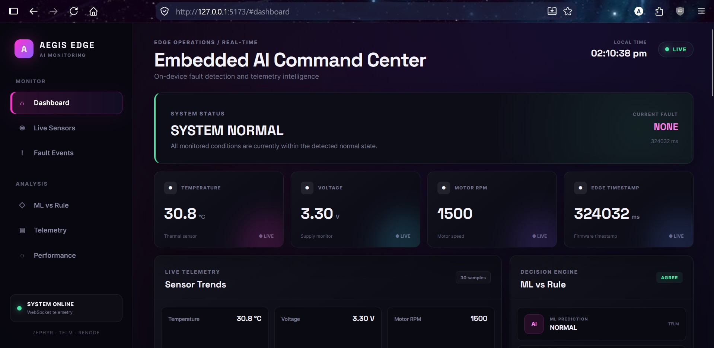
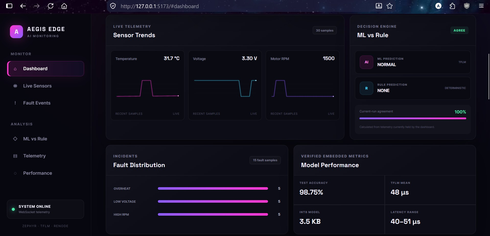
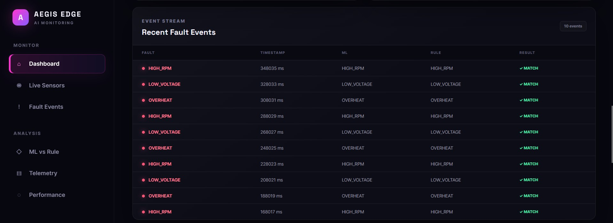
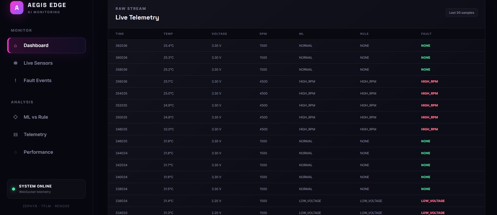

# Aegis Edge

**AI-Powered Embedded Fault Detection and Telemetry System**

Aegis Edge is an embedded AI fault-detection system that combines a compact INT8 TinyML model with deterministic safety rules on Zephyr RTOS. The system runs inference locally, detects abnormal sensor conditions, emits structured telemetry, and exposes the results through a live web dashboard.

| Main Dashboard | Live Sensor Trends |
|:---:|:---:|
|  |  |

| Fault Event Monitoring | Raw Live Telemetry |
|:---:|:---:|
|  |  |

## Overview

Aegis Edge monitors three sensor signals:

- Temperature
- Voltage
- Motor RPM

The embedded system classifies operating conditions as:

- `NORMAL`
- `OVERHEAT`
- `LOW_VOLTAGE`
- `HIGH_RPM`

The ML prediction is paired with a deterministic rule-based prediction. Telemetry is then forwarded from the simulated embedded target to a Python backend and displayed through a React dashboard.

## Architecture

```text
Sensor Simulation
      ↓
Zephyr Firmware
      ↓
TFLM INT8 Inference
      ↓
ML Prediction + Rule Prediction
      ↓
UART / CSV Telemetry
      ↓
Renode UART File Backend
      ↓
Telemetry Bridge
      ↓
FastAPI Backend
      ↓
WebSocket
      ↓
React Dashboard
```

## Key Features

- On-device TinyML fault classification using TensorFlow Lite Micro
- INT8 quantized model
- Zephyr RTOS firmware
- Deterministic rule-based fault detection
- Renode-based fault injection and recovery testing
- Structured CSV telemetry
- FastAPI telemetry backend
- WebSocket live updates
- React dashboard
- Current-run telemetry history retained across dashboard refreshes
- One-command runtime startup with `run_aegis.sh`

## Machine Learning

The deployed model is an INT8 TensorFlow Lite Micro model.

| Metric          | Verified result |
| --------------- | --------------: |
| Test accuracy   |      **98.75%** |
| INT8 model size |      **3.5 KB** |
| Fault classes   |           **3** |

The three fault classes are overheat, low voltage, and high RPM, with `NORMAL` as the non-fault operating state.

## Embedded Deployment

The model is integrated into the Zephyr firmware and executed using TensorFlow Lite Micro (TFLM).

### Measured TFLM latency

A dedicated 100-sample benchmark produced:

| Metric  |    Result |
| ------- | --------: |
| Samples |   **100** |
| Minimum | **40 µs** |
| Mean    | **48 µs** |
| Maximum | **51 µs** |

**Measurement environment:** Zephyr RTOS running in Renode.

This is a Renode/Zephyr embedded execution measurement and is not a physical STM32 hardware latency measurement.

## Fault Injection Validation

A clean Renode validation run verified the following completed fault cycles:

| Scenario          | Injected condition       | ML          | Rule        | Recovery |
| ----------------- | ------------------------ | ----------- | ----------- | -------- |
| Overheat          | 95.0°C, 3.30 V, 1500 RPM | OVERHEAT    | OVERHEAT    | ✅       |
| Low voltage       | ~26°C, 2.20 V, 1500 RPM  | LOW_VOLTAGE | LOW_VOLTAGE | ✅       |
| High RPM          | ~27°C, 3.30 V, 4500 RPM  | HIGH_RPM    | HIGH_RPM    | ✅       |
| Repeated overheat | 95.0°C, 3.30 V, 1500 RPM | OVERHEAT    | OVERHEAT    | ✅       |

For every completed fault cycle, the ML and deterministic rule predictions agreed. After each completed fault cycle, the firmware returned to:

```text
ML PREDICTION: NORMAL
RULE PREDICTION: NONE
FAULT=NONE
```

The validation run produced **50 CSV telemetry records** before the log was captured. A subsequent low-voltage cycle had begun, so it was not counted as a completed recovery result.

## Telemetry and Dashboard

Telemetry is emitted by the firmware in structured CSV form:

```text
CSV,timestamp,temp,voltage,rpm,fault,ml_prediction,rule_prediction
```

The telemetry bridge watches the Renode UART log and forwards parsed records to the FastAPI backend.

The backend provides:

- REST telemetry ingestion
- Health endpoint
- WebSocket streaming
- Current-run telemetry history

The React dashboard displays live telemetry and restores the retained current-run history after a browser refresh.

## Running the Project

### Prerequisites

The project uses separate Python environments:

- `zephyr-venv` for Zephyr/west firmware development and builds
- `ml-venv` for the Python ML/backend/telemetry workflow

The runtime launcher uses the existing built firmware and does not replace the Zephyr development environment.

### Build firmware

Activate the Zephyr environment:

```bash
source ~/zephyr-venv/bin/activate
```

Build the TFLM firmware using the project's existing Zephyr build workflow.

### Start the complete runtime

From the repository root:

```bash
./run_aegis.sh
```

The launcher starts:

1. FastAPI backend
2. Telemetry bridge
3. Renode
4. React/Vite frontend

Then open:

```text
http://127.0.0.1:5173
```

Press `Ctrl+C` to stop the Aegis Edge runtime.

### Optional WebSocket diagnostic

The standalone WebSocket test is a diagnostic tool and is not required for normal operation:

```bash
python tools/test_websocket.py
```

## Renode Testing

The Renode test script can also be run independently:

```bash
./tests/renode/run_test.sh
```

The Renode script loads:

```text
firmware/app/build-tflm/zephyr/zephyr.elf
```

and routes USART2 output to:

```text
/tmp/aegis_uart.log
```

The UART analyzer remains available in Renode while the file backend records telemetry.

## Project Structure

```text
aegis-edge/
├── firmware/
│   └── app/
│       ├── include/
│       └── src/
├── tests/
│   └── renode/
│       ├── aegis.resc
│       └── run_test.sh
├── tools/
│   ├── backend.py
│   ├── telemetry_bridge.py
│   └── test_websocket.py
├── frontend/
│   └── src/
├── run_aegis.sh
└── README.md
```

## Validation Status

The following end-to-end components have been validated:

- ML model inference
- INT8 TFLM deployment
- Zephyr firmware
- Renode fault injection
- ML/rule prediction agreement
- Fault recovery
- UART/CSV telemetry
- Telemetry bridge
- FastAPI backend
- WebSocket streaming
- React live dashboard
- Dashboard history restoration after refresh
- One-command runtime startup
- 100-sample TFLM latency benchmark

## Known Limitations

The current quantitative validation does not yet include:

- End-to-end telemetry latency
- TFLM arena/runtime memory usage
- Long-duration stability statistics
- Large-scale fault-injection statistics
- Physical STM32 hardware inference latency

## Documentation

Verified project measurements and validation notes are maintained in:

```text
docs/VERIFIED_METRICS.md
```

## Current Status

Aegis Edge is an end-to-end functional embedded AI prototype with verified ML, TFLM deployment, fault injection/recovery, telemetry, backend, WebSocket, dashboard, and one-command runtime integration.
